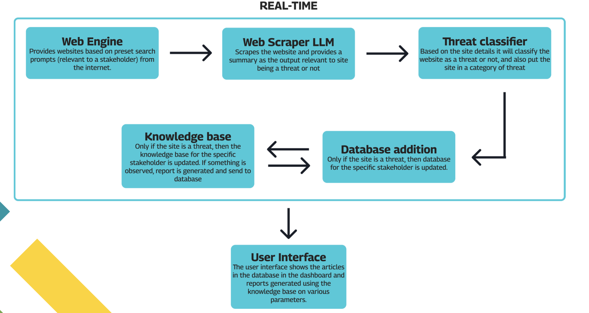

## 🚀 **Team Name:**  
### **HackSmiths**

## 🏆 **Project Title:**  
**Developing a tool to provide real-time feeds of
cyber incidents pertaining to Indian Cyber Space.**

### PS Chosen for Internal Hackathon: SIH1677

## Team Details

**Team Leader:** Harsh Kumar (2021UCA1829) [@DeveHk](https://github.com/DeveHk)

**Team Members:**

- **MEMBER_1** - Harsh Kumar   (2021UCA1829) - [@DeveHk](https://github.com/DeveHk)
- **MEMBER_2** - Raghav Mangla (2021UCA1822) - [@RaghavMangla](https://github.com/RaghavMangla)
- **MEMBER_3** - Avneet Singh Bedi (2021UCA1815) - [@avneets2103](https://github.com/avneets2103)
- **MEMBER_4** - Sneha Gupta (2021UCA1859) - [@snehagupta20](https://github.com/snehagupta20)
- **MEMBER_5** - Balvinder Singh (2021UCA1845) - [@balvind3r](https://github.com/balvind3r)
- **MEMBER_6** - Laksshay Sehrawat (2021UCA1802) - [@Laksshay-Sehrawat](https://github.com/Laksshay-Sehrawat)

 

 

# 🧐 **Problem Overview:**
**India's Critical Information Infrastructure (CII) faces severe cyber threats, endangering national security and economic stability.**

1. **Current Gap**: 
> The NCIIPC’s existing system lacks real-time monitoring, leading to no threat assessment and huge response gaps.
2. **Need for Real-Time Solution**:
> **Framework Required**: Development of a dynamic system to monitor and analyze cyber incidents
specific to Indian cyberspace.

> **Machine Learning Integration**: Use ML to identify and aggregate data from diverse sources, including
forums, social media, and news platforms.

3. **Inhouse Models**: 

> Since its a national issue, these LLMs, RAGs, Scrapers, and servers must be in-house. Thus computing,
storing and usage remains safe.

# 📄 **Project Description:**  
**Real-Time Cyber Threat Monitoring Solution for India's CII**

We propose a real-time cyber defense system to protect India’s Critical Information Infrastructure (CII) from evolving threats. 

The solution leverages in-house machine learning
models to monitor, scrape, and classify data from a range of sources such as news platforms,
forums, and social media, identifying potential threats.

### **Key Features:**
1. **Threat Classification**: Automated risk assessment using a robust classifier, categorizing
threats like malware, phishing, or espionage.
2. **Knowledge Base**: Secure and real-time updates to the knowledge base for detected
threats.
3. **In-House Models**: Ensuring privacy, data security, and full national control over
infrastructure by keeping all models and servers within India.
4. **User Interface**: Stakeholders receive real-time insights through an intuitive interface, with
dashboards and reports enabling quick, informed responses.

This system addresses current gaps in the NCIIPC’s framework, ensuring faster response
times, continuous monitoring, and enhanced national security.

# **Objectives:**
**Strengthen India’s Critical Information Infrastructure (CII) Cybersecurity**

1. **Real-Time Threat Monitoring**: 
> Implement a 24/7 surveillance system to reduce response times to cyber threats from an average of 48 hours to under 2 hours.
2. **Comprehensive Threat Coverage**: 
> Target monitoring of 100,000+ sources, including social media, forums, and news platforms, covering 95% of cyber threat vectors impacting CII.
3. **Increased Detection Accuracy**: 
> Achieve 95% accuracy in threat classification, reducing false positives by over 50%, and ensuring only actionable insights are flagged.
4. **Response Acceleration**: 
> Enable threat assessment and mitigation in under 30 minutes from detection, cutting down the current response gap by over 70%.
5. **National Data Sovereignty**: 
> Ensure that 100% of data processing, threat identification, andstorage remain within national infrastructure, safeguarding critical information.

**This system will significantly reduce cyber incident impacts, improve national resilience,
and close existing defense gaps, securing India’s economic and national stability.**

# **Data Flow:**

# 🛠️ **Technologies Used:**  
 
 
 

 

 
 
 
 
 
 
 
 
 
 

### **Frontend & Edge Functions:**
- **Next.js:** A versatile and powerful framework for building server-rendered React applications.
- **Typescript::** A strongly typed programming language that builds on JavaScript, helps reduce bugs, and improves code quality.
- **Redux Tool Kit:** A state management library for React applications. Very fast and easy to use.
- **Next UI:** A React UI library that provides a set of high-quality UI components. Saves time and effort.
- **Aceternity:** A React UI library that provides a set of high-quality UI components.
- **Tailwind CSS:** A utility-first CSS framework that provides a set of high-quality UI components. Makes CSS writing super fast.

### **Website Backend:**
- **Node:** A JavaScript runtime built on Chrome's V8 JavaScript engine. It's fast, it's easy to use, and it works on all operating systems.
- **MongoDB:** A document database that stores data in flexible, JSON-like documents.

### **Python Server:**
- **LangChain:** 

## Project Links
 
- **SIH Presentation:** [Final SIH Presentation]()
- **Video Demonstration:** [Watch_Demo Video]()
- **Live Deployment:** [View Deployment](https://sih-app.vercel.app/login)
- **Source Code for Website:** [Internal-Website]()
- **Source Code for Python server:** [Med-Python-Server]()

